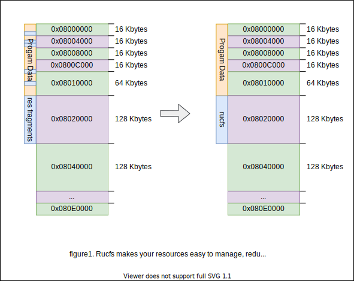

## Rucfs
Rucfs `/ˈrɑːkˈɛfˈɛs/` is a _Read-only Un-Compressed File System_.  
It provides a simple and compact structure to store data up to 4GB.

It supports regular files, nested directories, and symbolic links.  
Very suit for embedded systems that pursues size and low memory. such as STM32, ESP.. etc.

 

## Advantages
For example, this is the Rucfs diagram of STM32F4x chips.


## Prepare your Rucfs image
> Make sure you have installed python 3.
``` bash
# Usage: mkfs.rucfs.py <directory> <output>
$ tools/mkfs.rucfs.py ./dir_to_pack/ rucfs.img
```

## Use Rucfs on the chip
```c
// load a rucfs image
rucfs_ctx_t ctx;
if(!rucfs_ok(rucfs_load(image, &ctx))) {
  printf("[****] Rucfs failed to load.");
  return 1;
}

// open the file
rucfs_file_t *file;
if(!rucfs_ok(rucfs_fopen(&ctx, "/hello/world.jpg", &file))) {
  printf("[****] No such file or directory.");
  return 2;
}

// the description of the file
char     *name  = file->name;
uint8_t  *data  = file->data;
uint32_t length = file->length;
printf("[ OK ] File loaded. Length %d", length);

// close the file
rucfs_fclose(file);
```

## TODOs
- [ ] Big Endian
- [ ] Read/Write HAL
- [x] Benchmark and Tests
- [x] mkfs.rucfs
- [x] Readme diagram

## License
Licensed under MIT with ❤.

## Thanks
- [@takayama-lily](https://github.com/takayama-lily)
- [@LXY1226](https://github.com/LXY1226)
- [@Angelic47](https://github.com/Angelic47)
